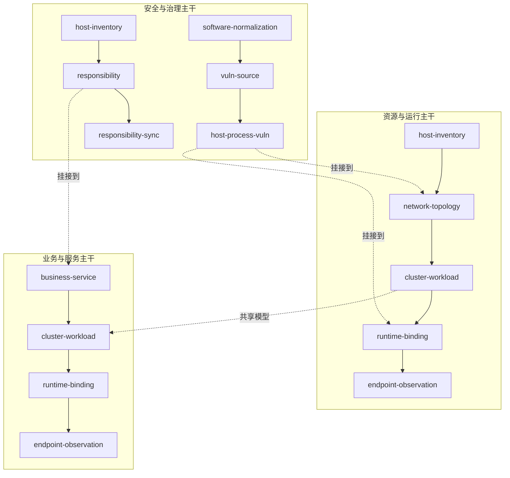
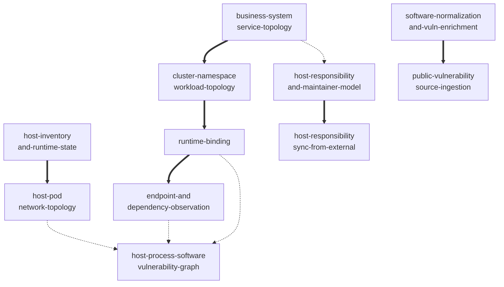

# dayu-topology 统一模型总图

## 1. 文档目的

本文档把 `dayu-topology` 当前已经收敛出的各组模型放到同一个总图中，明确：

- 哪些是目录对象
- 哪些是运行对象
- 哪些是关系对象
- 哪些是治理对象
- 这些对象之间如何形成统一中心图谱

相关文档：

- [`glossary.md`](../glossary.md)
- [`scenario-and-scope-model.md`](./scenario-and-scope-model.md)
- [`../model/host-inventory-and-runtime-state.md`](../model/host-inventory-and-runtime-state.md)
- [`../model/host-pod-network-topology-model.md`](../model/host-pod-network-topology-model.md)
- [`../model/business-system-service-topology-model.md`](../model/business-system-service-topology-model.md)
- [`../model/software-normalization-and-vuln-enrichment.md`](../model/software-normalization-and-vuln-enrichment.md)
- [`../model/host-responsibility-and-maintainer-model.md`](../model/host-responsibility-and-maintainer-model.md)

---

## 2. 核心结论

`dayu-topology` 第一版应被理解为一个统一中心对象图谱，由五层组成：

- 业务架构层
- 资源目录层
- 运行实例层
- 软件与安全层
- 责任治理层

一句话说：

- 上层回答“业务和系统如何组织”
- 中层回答“资源和服务是什么”
- 下层回答“它们现在跑在哪里、依赖谁、谁负责、受什么漏洞影响”

同时需要明确：

- 这是一套统一模型，不是按家庭/企业/多云等场景拆成多套模型
- 不同场景通过不同的对象启用范围和能力范围来收敛复杂度
- 具体场景分级见 [`scenario-and-scope-model.md`](./scenario-and-scope-model.md)

---

## 3. 五层模型

### 3.1 业务架构层

对象包括：

- `BusinessDomain`
- `SystemBoundary`
- `Subsystem`
- `ServiceEntity`

回答：

- 一个业务包含哪些系统与子系统
- 一个系统包含哪些逻辑服务

### 3.2 资源目录层

对象包括：

- `HostInventory`
- `PodInventory`
- `NetworkDomain`
- `NetworkSegment`
- `SoftwareEntity`

回答：

- 主机、Pod、网络、软件这些稳定对象是谁

### 3.3 运行实例层

对象包括：

- `HostRuntimeState`
- `ProcessRuntimeState`
- `ServiceInstance`
- `SvcEp`
- `InstEp`

回答：

- 当前实例如何运行
- 当前入口和实例地址是什么
- 当前状态如何

### 3.4 关系图谱层

对象包括：

- `PodPlacement`
- `PodNetAssoc`
- `HostNetAssoc`
- `DepEdge`
- `SoftwareEvidence`

回答：

- 对象之间是什么关系
- 服务依赖谁
- Pod 落在哪个节点上
- Pod/Host 接入哪些网络
- 哪些事实指向某个软件实体

### 3.5 责任治理层

对象包括：

- `Subject`
- `HostGroup`
- `HostGroupMembership`
- `ResponsibilityAssignment`
- `ExternalIdentityLink`
- `ExternalSyncCursor`
- `SoftwareVulnerabilityFinding`

回答：

- 谁负责这些对象
- 外部系统如何同步归属
- 哪些软件受哪些漏洞影响

---

## 4. 统一关系主图

第一版建议固定以下主关系：

```text
BusinessDomain
  -> SystemBoundary[]
  -> ServiceEntity[]

SystemBoundary
  -> Subsystem[]
  -> ServiceEntity[]

ServiceEntity
  -> DepEdge[]
  -> SvcEp[]
  -> ServiceInstance[]

ServiceInstance
  -> InstEp[]
  -> PodInventory / ProcessRuntimeState
  -> HostInventory

HostInventory
  -> HostRuntimeState[]
  -> HostNetAssoc[]
  -> ResponsibilityAssignment[]

PodInventory
  -> PodPlacement[]
  -> PodNetAssoc[]

PodNetAssoc
  -> NetworkSegment

HostNetAssoc
  -> NetworkSegment

SoftwareEvidence
  -> SoftwareEntity

SoftwareEntity
  -> SoftwareVulnerabilityFinding[]

ResponsibilityAssignment
  -> Subject
```

---

## 5. 模型依赖分析

当前模型不是平铺关系，而是明显分层并存在前置依赖。

### 5.1 三条主干

第一版可以把模型依赖收敛成三条主干：

#### 资源与运行主干

```text
host-inventory-and-runtime-state
  -> host-pod-network-topology
  -> cluster-namespace-workload-topology
  -> runtime-binding
  -> endpoint-and-dependency-observation
```

说明：

- `host` 是资源运行底座
- `pod/network` 补充基础拓扑
- `cluster/namespace/workload` 补充编排边界
- `runtime-binding` 把服务实例和底层运行对象接起来
- `endpoint/dependency observation` 在绑定和地址归一基础上表达实际依赖关系

#### 业务与服务主干

```text
business-system-service-topology
  -> cluster-namespace-workload-topology
  -> runtime-binding
  -> endpoint-and-dependency-observation
```

说明：

- `business/system/service` 定义逻辑架构
- `cluster/namespace/workload` 定义部署编排载体
- `runtime-binding` 定义实例归属
- `endpoint/dependency observation` 定义连接与观测依赖

#### 安全与治理主干

```text
software-normalization-and-vuln-enrichment
  -> public-vulnerability-source-ingestion
  -> host-process-software-vulnerability-graph
```

```text
host-inventory-and-runtime-state
  -> host-responsibility-and-maintainer-model
  -> host-responsibility-sync-from-external-systems
```

说明：

- 软件与漏洞是一条横向安全治理主干
- 责任与外部同步是一条横向责任治理主干
- 它们分别挂接到资源和服务主线之上，而不是独立悬空存在

**图 C：三条主干依赖关系**



> 实线表示主干内的推进方向，虚线表示主干之间的挂接点。`cluster-workload` 是资源主干和业务主干的交汇点。

### 5.2 硬依赖关系

以下依赖属于前置不成立、后续模型就难以稳定定义的硬依赖：

- `host-inventory-and-runtime-state` -> `host-pod-network-topology`
- `business-system-service-topology` -> `cluster-namespace-workload-topology`
- `cluster-namespace-workload-topology` -> `runtime-binding`
- `runtime-binding` -> `endpoint-and-dependency-observation`
- `software-normalization-and-vuln-enrichment` -> `public-vulnerability-source-ingestion`
- `host-responsibility-and-maintainer-model` -> `host-responsibility-sync-from-external-systems`

### 5.3 集成依赖关系

以下依赖更偏闭环能力和查询能力上的集成依赖：

- `host-pod-network-topology` -> `host-process-software-vulnerability-graph`
- `runtime-binding` -> `host-process-software-vulnerability-graph`
- `business-system-service-topology` -> `host-responsibility-and-maintainer-model`
- `endpoint-and-dependency-observation` -> 后续服务风险传播和故障影响分析视图

**图 B：模型依赖关系**



> 粗实线（==>）表示硬依赖 —— 前置模型不成立，后续模型难以稳定定义。虚线（-.->）表示集成依赖 —— 偏闭环能力和查询能力上的依赖。

### 5.4 实现顺序建议

第一版建议按以下批次推进，与 [`development-plan.md`](../roadmap/development-plan.md) 的 Phase 划分保持一致：

**Phase A —— 核心目录与责任（并行）**

- `host-inventory-and-runtime-state`
- `business-system-service-topology`
- `host-responsibility-and-maintainer-model`

说明：先让主机、业务/服务、责任主体等核心目录对象站稳，这是整张图谱的底座。

**Phase B —— 编排与网络拓扑**

- `host-pod-network-topology`
- `cluster-namespace-workload-topology`

说明：在核心目录基础上补充编排边界和网络拓扑关系。

**Phase C —— 运行绑定与依赖观测**

- `runtime-binding`
- `endpoint-and-dependency-observation`

说明：运行态归属和服务间依赖建立在稳定目录对象之上。

**Phase D —— 软件安全与漏洞**

- `software-normalization-and-vuln-enrichment`
- `public-vulnerability-source-ingestion`
- `host-process-software-vulnerability-graph`

说明：软件归一和漏洞命中是横向安全治理能力，依赖核心目录和运行绑定完成后再接入。

**Phase E —— 统一 Schema 收敛**

- `unified-topology-schema`

说明：在各批模型基本稳定后，做一次统一的 schema 对齐和整理。

这条顺序符合当前模型之间的依赖方向，也与开发计划的 Phase 划分、schema 落表优先级一致。

**图 A：模型构建阶段**

```mermaid
flowchart LR
  subgraph PA["Phase A<br>核心目录与责任"]
    direction TB
    A1["host-inventory<br>and-runtime-state"]
    A2["business-system<br>service-topology"]
    A3["host-responsibility<br>and-maintainer-model"]
  end
  subgraph PB["Phase B<br>编排与网络拓扑"]
    direction TB
    B1["host-pod<br>network-topology"]
    B2["cluster-namespace<br>workload-topology"]
  end
  subgraph PC["Phase C<br>运行绑定与依赖观测"]
    direction TB
    C1["runtime-binding"]
    C2["endpoint-and<br>dependency-observation"]
  end
  subgraph PD["Phase D<br>软件安全与漏洞"]
    direction TB
    D1["software-normalization<br>and-vuln-enrichment"]
    D2["public-vulnerability<br>source-ingestion"]
    D3["host-process-software<br>vulnerability-graph"]
  end
  subgraph PE["Phase E<br>统一Schema收敛"]
    direction TB
    E1["unified-topology-schema"]
  end

  PA --> PB --> PC --> PD --> PE
```



> Phase A 的三个模型可并行推进。Phase B 起每批都依赖上一批的产出。

## 6. 关键边界

第一版必须固定以下边界：

### 6.1 目录对象与运行对象分开

- `HostInventory` 不等于 `HostRuntimeState`
- `ServiceEntity` 不等于 `ServiceInstance`
- `SoftwareEntity` 不等于 `ProcessRuntimeState`

### 6.2 逻辑关系与网络关系分开

- `DepEdge` 表达逻辑依赖
- `PodNetAssoc` / `HostNetAssoc` 表达拓扑接入

### 6.3 责任关系独立建模

- 不把 `owner`、`maintainer`、`oncall` 直接塞进资源对象单字段
- 通过 `ResponsibilityAssignment` 单独建模

### 6.4 软件与漏洞独立建模

- 漏洞不直接挂在 `host`、`process`、`service` 原生字段上
- 通过 `software -> finding` 再回连到 host / service

---

## 7. 统一查询视角

这套总图最终应支撑以下查询：

- 某个业务包含哪些系统、服务和实例
- 某个服务当前跑在哪些 pod / host 上
- 某个 host 故障会影响哪些服务和业务
- 某个网络段连接了哪些 pod / host / service
- 某个漏洞影响哪些软件、服务和主机
- 某个对象当前由谁负责、值班人是谁

---

## 8. 当前建议

当前建议固定为：

- `dayu-topology` 第一版不是单一 CMDB，也不是单一 runtime store
- 它是“目录对象 + 运行对象 + 关系对象 + 治理对象”的统一中心图谱
- 后续 schema、ingest、query、sync 都应围绕这张总图展开
