# dayu-topology 可视化架构指南

## 1. 文档目的

本文档把 `dayu-topology` 的关键设计、结构和过程整理成可传播的专业图示。

目标是帮助读者快速理解：

- 系统边界是什么
- 核心模块如何协作
- 数据如何进入中心模型
- source of truth 与 read model 如何分层
- 外部同步、identity resolution、查询和部署如何落地

相关文档：

- [`project-charter.md`](./project-charter.md)
- [`system-architecture.md`](./system-architecture.md)
- [`dataflow-and-pipeline-architecture.md`](./dataflow-and-pipeline-architecture.md)
- [`identity-resolution-architecture.md`](./identity-resolution-architecture.md)
- [`external-sync-architecture.md`](./external-sync-architecture.md)
- [`query-and-read-model-architecture.md`](./query-and-read-model-architecture.md)
- [`unified-model-overview.md`](./unified-model-overview.md)
- [`../roadmap/development-plan.md`](../roadmap/development-plan.md)
- [`../roadmap/todo-backlog.md`](../roadmap/todo-backlog.md)

---

## 2. 一页总览

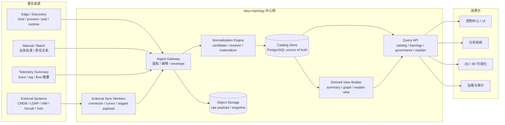

核心含义：

- 外部输入只是事实来源，不直接等于中心对象。
- `Normalization Engine` 是中心语义层。
- PostgreSQL 是 source of truth。
- 派生视图只服务查询和展示，不反向成为事实源。

---

## 3. 系统边界图

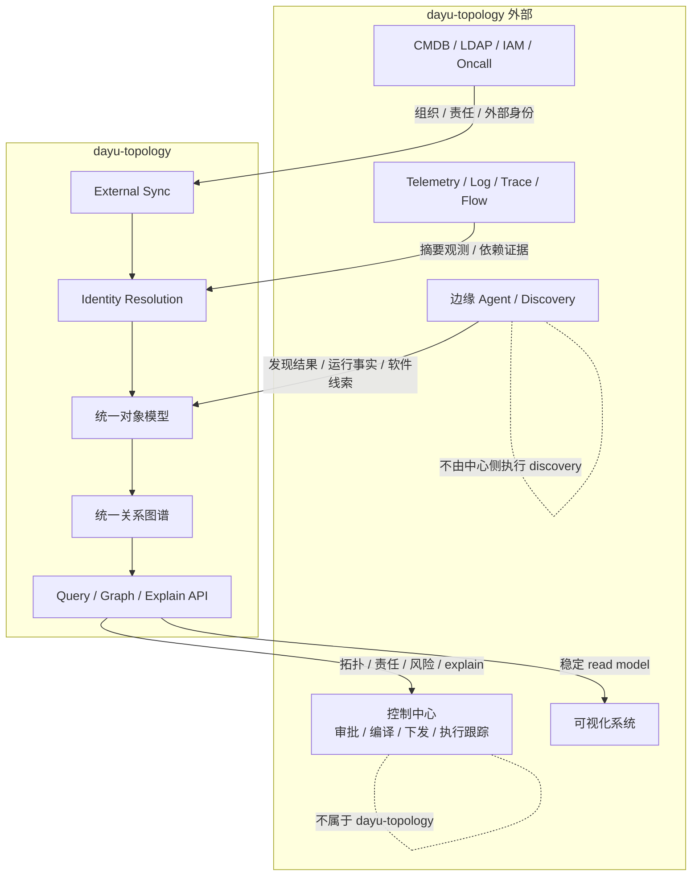

边界结论：

- `dayu-topology` 不做边缘采集，不做控制面执行。
- `dayu-topology` 提供中心侧目录、关系、查询、同步与治理底座。
- 可视化系统消费 read model，不重新定义领域模型。

---

## 4. 逻辑模块图

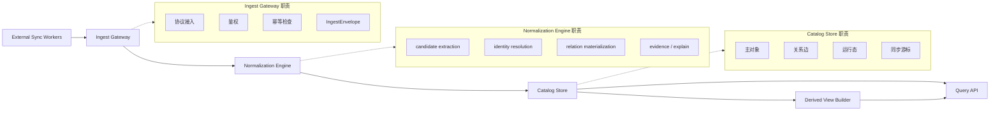

模块原则：

- 写路径负责事实归一和主对象落库。
- 读路径负责把中心对象投影成稳定视图。
- sync 是独立运行时能力，不应绕过 normalization。

---

## 5. 主写路径 Pipeline

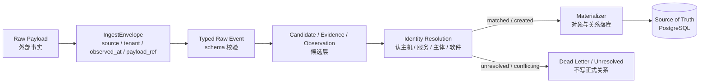

关键约束：

- `Candidate` 不是中心主对象。
- unresolved candidate 不允许硬写成正式关系。
- resolver 必须保留来源、置信度和 explain 信息。

---

## 6. Identity Resolution 流程

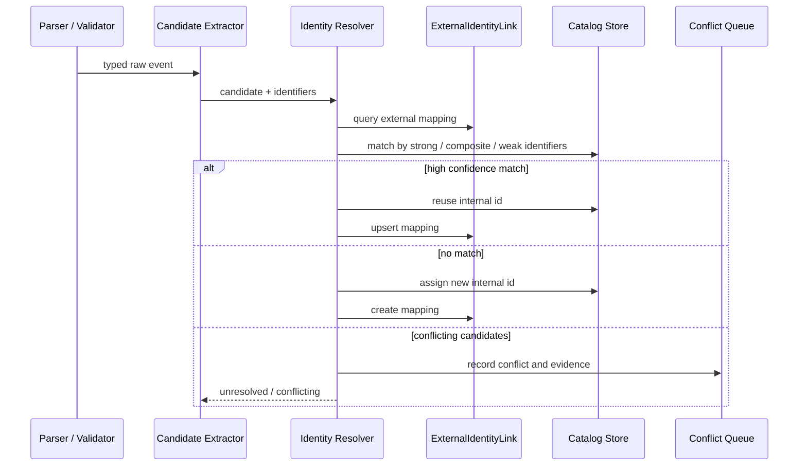

规则层次：

- 强标识：`machine_id`、`pod_uid`、`external_id`、`purl`。
- 组合标识：`cluster + namespace + workload_kind + workload_name`。
- 弱标识：display name、binary name、email 前缀，只能辅助判断。

---

## 7. 统一模型分层图

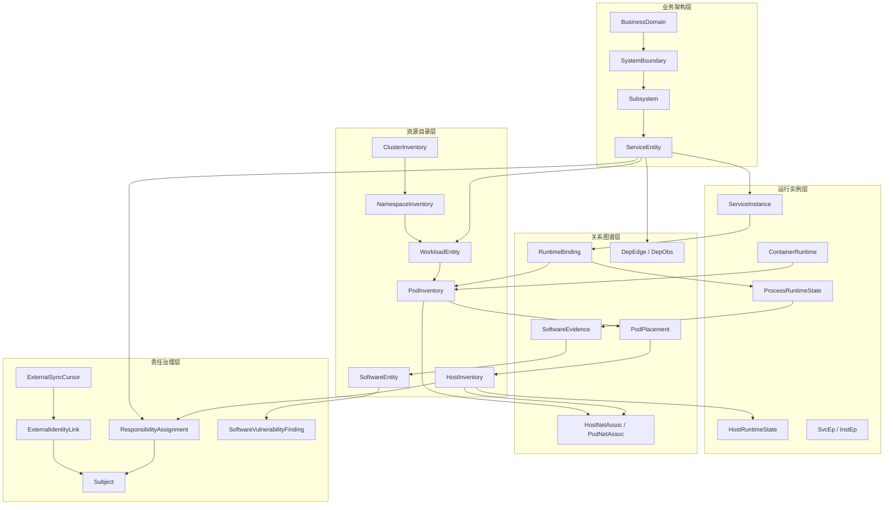

分层理解：

- 上层回答业务和系统如何组织。
- 中层回答资源、工作负载、软件是谁。
- 下层回答运行实例、依赖、责任和风险如何形成。

---

## 8. 存储分层图

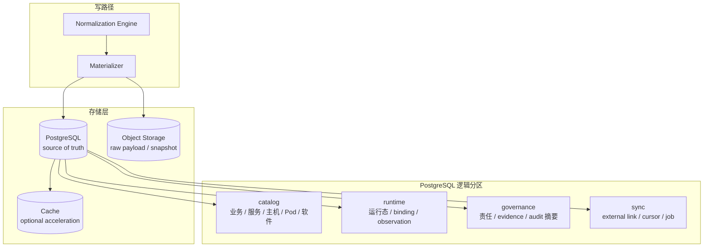

存储原则：

- 主对象和关系对象进入 PostgreSQL。
- 原始 payload 和大快照进入对象存储。
- 缓存只做加速，不做 source of truth。

---

## 9. 读路径与 Read Model

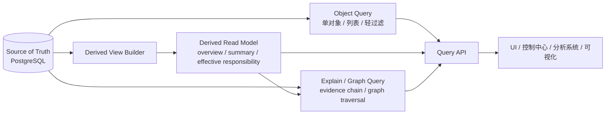

查询原则：

- 简单对象查询可直读主库。
- 复杂聚合与全景视图走 read model。
- explain 与 graph 查询独立分层，避免污染普通列表接口。
- Query API 不直接暴露底表。

---

## 10. External Sync 流程

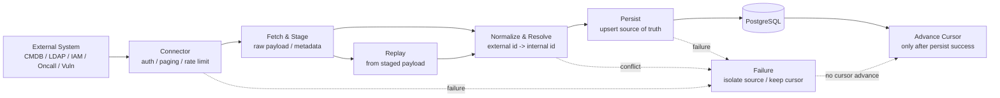

同步原则：

- connector 只负责拉取，不负责绕过中心模型写库。
- staged payload 支持失败重放。
- cursor 只在主写成功后推进。
- 一个源失败不阻塞其他源。

---

## 11. 第一版部署演进图

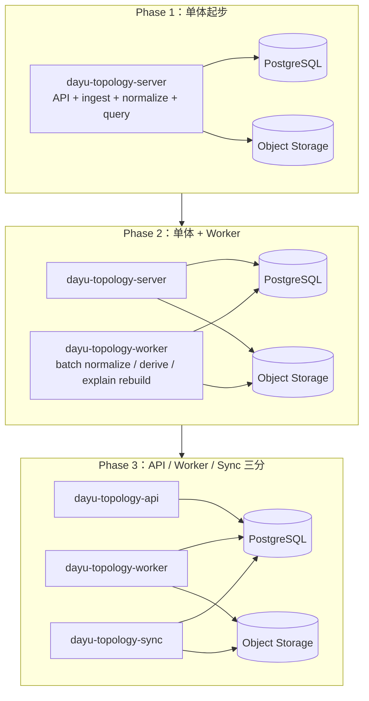

演进原则：

- 第一版单体优先。
- 逻辑边界先清楚，物理拆分按压力与隔离需求推进。
- sync、worker、query 都应能独立扩展，但不应提前复杂化。

---

## 12. 代码与 crate 映射图

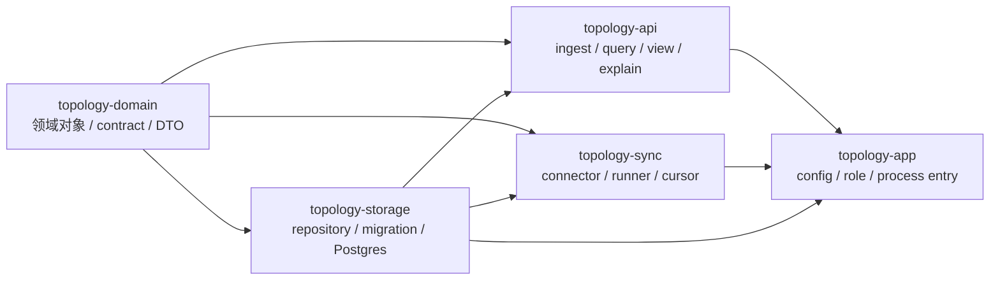

crate 原则：

- `topology-domain` 是领域语义单一来源。
- `topology-storage` 只做存储 contract 和实现。
- `topology-api` 提供 ingest 与 query 能力。
- `topology-sync` 提供外部同步能力。
- `topology-app` 只做装配与运行角色选择。

---

## 13. 第一版开发路线图

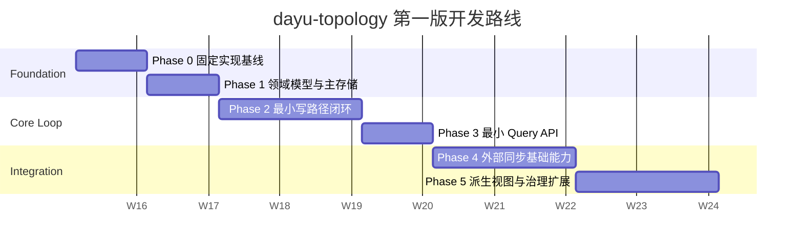

路线原则：

- 先让模型和主库站稳。
- 再打通 ingest 到 query 的最小闭环。
- sync 和 derived view 建立在稳定 source of truth 之上。

---

## 14. 传播建议

对外介绍时建议按以下顺序使用图：

1. 一页总览
2. 系统边界图
3. 主写路径 Pipeline
4. 统一模型分层图
5. 读路径与 Read Model
6. External Sync 流程
7. 第一版部署演进图

对研发评审时建议补充：

- Identity Resolution 流程
- 存储分层图
- 代码与 crate 映射图
- 第一版开发路线图
