# dayu-topology 可视化架构指南

## 1. 文档目的

本文档把 `dayu-topology` 的关键设计整理成可传播的专业图示。每张图只配简短说明，详细论述见对应的架构文档。

## 2. 一页总览

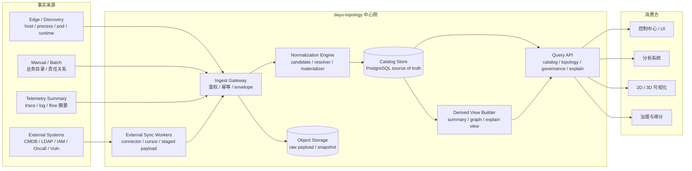

外部输入只是事实来源，不直接等于中心对象。`Normalization Engine` 是中心语义层，PostgreSQL 是 source of truth。

## 3. 系统边界图

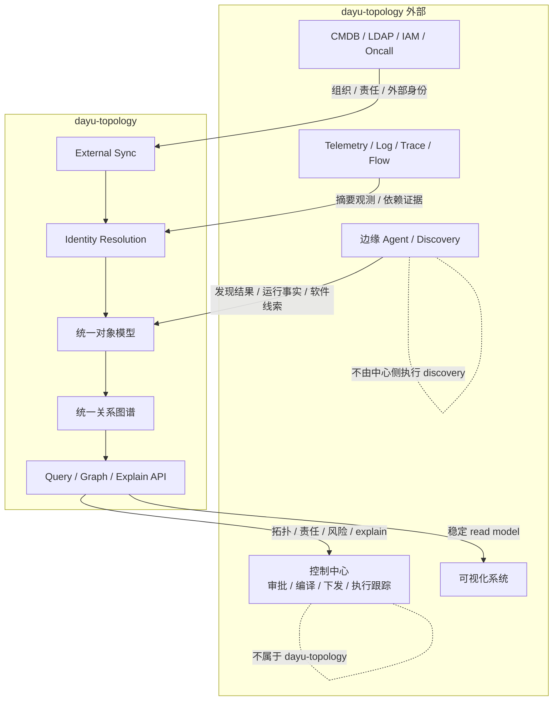

`dayu-topology` 不做边缘采集，不做控制面执行。可视化系统消费 read model，不重新定义领域模型。

## 4. 逻辑模块与职责

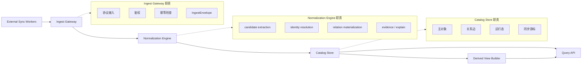

写路径负责事实归一和主对象落库，读路径负责投影成稳定视图。sync 是独立运行时能力，不绕过 normalization。

## 5. 主写路径 Pipeline

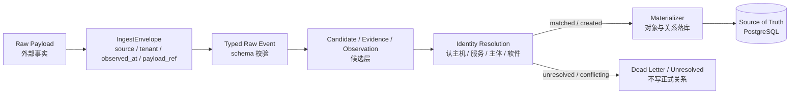

Candidate 不是中心主对象。Unresolved candidate 不允许硬写成正式关系。Resolver 必须保留来源、置信度和 explain 信息。

## 6. Identity Resolution 流程

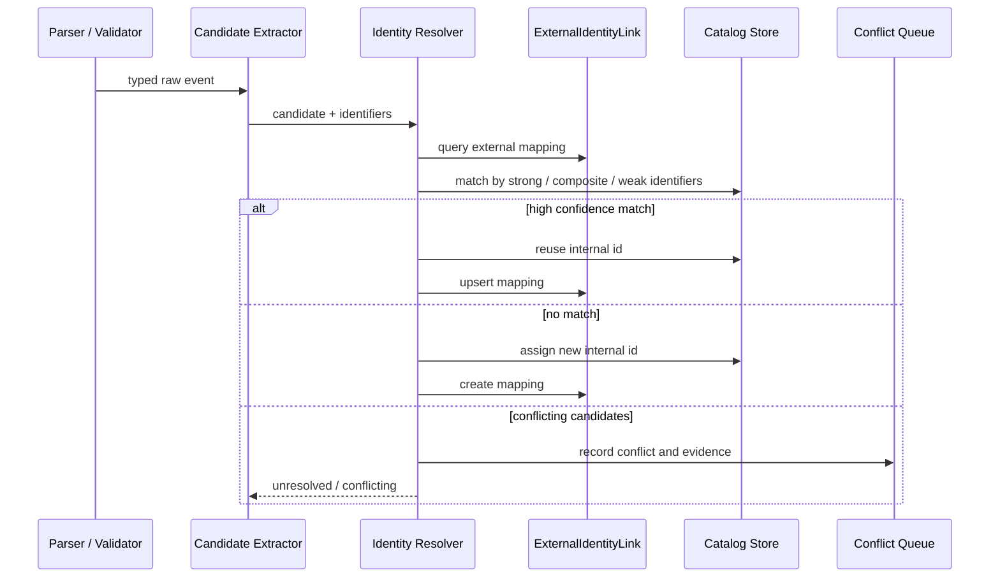

规则层次：强标识 (`machine_id`, `pod_uid`, `external_id`, `purl`) > 组合标识 (`cluster+namespace+kind+name`) > 弱标识（仅辅助判断）。

## 7. 统一模型分层图

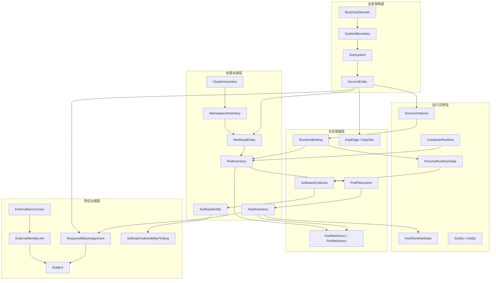

五层模型：业务架构层回答"业务和系统如何组织"，资源目录层回答"资源和服务是谁"，运行实例层回答"当前状态"，关系图谱层回答"对象间关系"，责任治理层回答"谁负责、受什么漏洞影响"。

## 8. 存储分层图

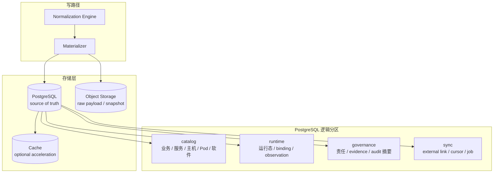

主对象和关系对象进入 PostgreSQL，原始 payload 和大快照进入对象存储，缓存只做加速。

## 9. 读路径与 Read Model

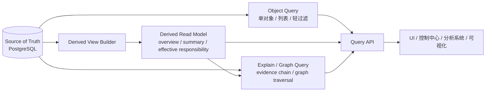

简单对象查询可直读主库，复杂聚合与全景视图走 read model，explain 与 graph 查询独立分层，Query API 不直接暴露底表。

## 10. External Sync 流程

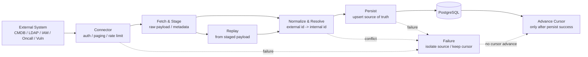

Cursor 只在主写成功后推进，staged payload 支持失败重放，一个源失败不阻塞其他源。

## 11. 第一版部署演进

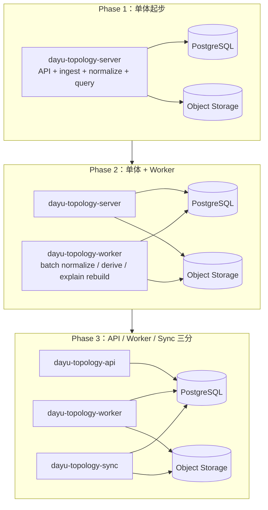

第一版单体优先，逻辑边界先清楚，物理拆分按压力与隔离需求推进。

## 12. Crate 映射

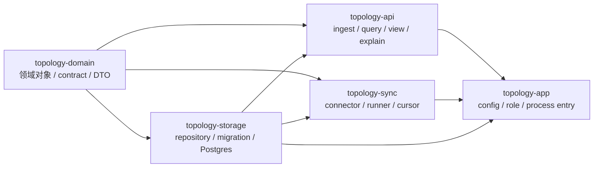

`topology-domain` 是领域语义单一来源，`topology-storage` 只做存储 contract 和实现，`topology-api` 提供 ingest 与 query，`topology-sync` 提供外部同步，`topology-app` 只做装配。

## 13. 第一版开发路线

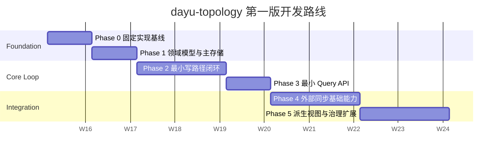

先让模型和主库站稳，再打通 ingest 到 query 的最小闭环，sync 和 derived view 建立在稳定 source of truth 之上。

## 14. Web 可视化

本文档包含设计阶段的静态架构图。Web 端交互式拓扑可视化的前端架构设计，见 [`../frontend/architecture.md`](../frontend/architecture.md)。

## 15. 模型详细图解索引

以下图解分布在对应的模型与架构文档中，本文档只保留总览图。

### 构建与依赖

| 图 | 位置 |
|---|---|
| 图 A：模型构建阶段（Phase A→E） | [`unified-model-overview.md` §5.4](./unified-model-overview.md#54-实现顺序建议) |
| 图 B：模型硬依赖与集成依赖 | [`unified-model-overview.md` §5.3](./unified-model-overview.md#53-集成依赖关系) |
| 图 C：三条主干依赖关系 | [`unified-model-overview.md` §5.1](./unified-model-overview.md#51-三条主干) |

### 模型内实体关系

| 模型文档 | 图 | 位置 |
|---|---|---|
| `business-system-service-topology-model.md` | 业务架构层 ER 图 | [§5 对象模型](../model/business-system-service-topology-model.md) |
| `host-inventory-and-runtime-state.md` | 主机目录与运行态 ER 图 | [§5 对象模型](../model/host-inventory-and-runtime-state.md) |
| `host-pod-network-topology-model.md` | 网络拓扑 ER 图 | [§5 对象模型](../model/host-pod-network-topology-model.md) |
| `cluster-namespace-workload-topology-model.md` | 集群编排 ER 图 | [§5 对象模型](../model/cluster-namespace-workload-topology-model.md) |
| `runtime-binding-model.md` | 运行绑定关系图 | [§5 对象与关系模型](../model/runtime-binding-model.md) |
| `endpoint-and-dependency-observation-model.md` | 端点与依赖观测图 | [§5 对象模型](../model/endpoint-and-dependency-observation-model.md) |
| `software-normalization-and-vuln-enrichment.md` | 软件与漏洞 ER 图 | [§5 对象模型](../model/software-normalization-and-vuln-enrichment.md) |
| `host-process-software-vulnerability-graph.md` | 主机-进程-软件-漏洞链路图 | [§5 禁止事项](../model/host-process-software-vulnerability-graph.md) |
| `host-responsibility-and-maintainer-model.md` | 责任治理 ER 图 | [§5 角色定义](../model/host-responsibility-and-maintainer-model.md) |
| `public-vulnerability-source-ingestion.md` | 漏洞摄入流程图 | [§5 两条主路线](../model/public-vulnerability-source-ingestion.md) |
| `host-responsibility-sync-from-external-systems.md` | 外部同步流程图 | [§6 ExternalSyncCursor](../model/host-responsibility-sync-from-external-systems.md) |
