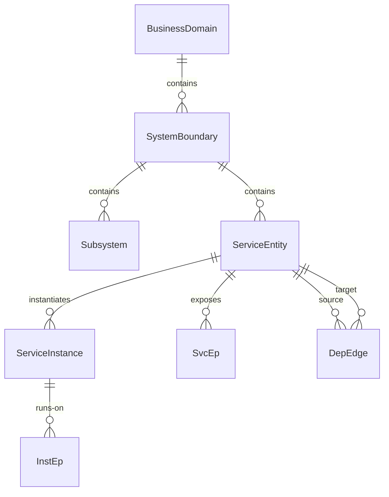

# dayu-topology Business / System / Service Topology 子模型设计

## 1. 文档目的

本文档定义 `dayu-topology` 中心侧从业务到服务运行态的拓扑子模型。

目标是固定：

- 一个业务如何包含多个系统和子系统
- 系统如何包含多个逻辑服务
- 服务之间的依赖如何表达
- 服务如何实例化到 `pod`、`process` 和 `host`
- 服务地址与服务实例地址如何分层建模

相关文档：

- [`glossary.md`](../glossary.md)
- [`host-pod-network-topology-model.md`](host-pod-network-topology-model.md)
- [`host-inventory-and-runtime-state.md`](host-inventory-and-runtime-state.md)
- [`host-process-software-vulnerability-graph.md`](host-process-software-vulnerability-graph.md)
- [`host-responsibility-and-maintainer-model.md`](host-responsibility-and-maintainer-model.md)

---

## 2. 核心结论

第一版固定以下结论：

- `business`、`system`、`service`、`service instance` 不是同一个对象
- 服务依赖关系必须独立建模，不挂在 `host` 或 `network` 上
- 服务的逻辑入口地址与实例运行地址必须分开
- 服务实例运行在 `pod`、`container` 或 `process` 之上，最终落到 `host`
- 这部分属于现有中心模型的业务拓扑扩展子模型，不是新体系

一句话说：

- `BusinessDomain` 回答“这个业务是什么”
- `ServiceEntity` 回答“这个业务由哪些服务组成”
- `ServiceInstance` 回答“这些服务现在跑在哪里”

---

## 3. 为什么必须分层

如果把模型写成：

```text
Business {
  services[]
  dependencies[]
  addresses[]
}
```

或者：

```text
Service {
  business = "payment"
  host_id = "host-1"
  address = "10.0.0.12:8080"
}
```

会出现明显问题：

- 一个业务可包含多个系统与多个子系统
- 一个逻辑服务可有多个实例
- 一个服务可有多个入口地址
- 一个实例地址是动态的，可能随 pod 漂移
- 服务依赖是逻辑关系，不等同实例连通性

因此应明确：

- 业务架构层单独建模
- 运行部署层单独建模
- 地址层单独建模
- 依赖层单独建模

---

## 4. 模型定位

这不是新的顶层模型，而是现有中心模型中的一个业务拓扑子模型。

它同时属于：

### 4.1 业务目录模型的扩展

以下对象属于业务目录层：

- `BusinessDomain`
- `SystemBoundary`
- `Subsystem`
- `ServiceEntity`

### 4.2 运行关系图谱的扩展

以下对象属于运行关系层：

- `ServiceInstance`
- `DepEdge`
- `SvcEp`
- `InstEp`

也就是说：

- 逻辑对象与运行对象分开
- 稳定地址与动态地址分开
- 服务依赖与网络 attachment 分开

---

## 5. 对象模型

### 5.0 核心术语中英对照

<!-- GLOSSARY_SYNC:START terms=BusinessDomain,SystemBoundary,Subsystem,ServiceEntity,ServiceInstance,SvcEp,InstEp,DepEdge -->
| 术语 | 中文名 | English | 中文说明 |
| `BusinessDomain` | 业务域对象 | Business domain object | 表示较高层业务边界，下挂多个系统、服务和运行对象。 |
| `SystemBoundary` | 系统边界对象 | System boundary object | 表示业务内部的系统边界，是服务编组和治理边界之一。 |
| `Subsystem` | 子系统对象 | Subsystem object | 表示系统内部更细一级的逻辑边界。 |
| `ServiceEntity` | 逻辑服务对象 | Service entity object | 表示业务架构中的逻辑服务定义，不等同实例、Pod 或地址。 |
| `ServiceInstance` | 服务运行实例 | Service runtime instance | 表示逻辑服务在运行时的短生命周期副本，是业务服务与运行对象之间的桥。 |
| `SvcEp` | 服务稳定入口 | Service endpoint | 表示服务的稳定访问入口，例如 DNS、VIP、Ingress。 |
| `InstEp` | 实例运行地址 | Instance endpoint | 表示实例当前运行地址，例如 Pod IP:Port 或 Host IP:Port。 |
| `DepEdge` | 服务依赖边 | Dependency edge | 表示服务依赖图中的一条边，不直接承载原始观测明细。 |


<!-- GLOSSARY_SYNC:END -->

### 5.1 `BusinessDomain`

表示业务域。

建议结构：

```text
BusinessDomain {
  business_id
  tenant_id
  name
  code?
  description?
  state?
  created_at
  updated_at
}
```

字段中英说明：

| 字段 | 中文说明 | English |
| --- | --- | --- |
| `business_id` | 业务域主键 | Business domain ID |
| `tenant_id` | 所属租户 | Tenant ID |
| `name` | 业务名称 | Business name |
| `code` | 业务编码 | Business code |
| `description` | 业务说明 | Description |
| `state` | 生命周期状态 | State |
| `created_at` | 创建时间 | Created time |
| `updated_at` | 更新时间 | Updated time |

回答：

- 这个业务是谁

### 5.2 `SystemBoundary`

表示业务下的系统边界。

建议结构：

```text
SystemBoundary {
  system_id
  business_id
  tenant_id
  name
  code?
  description?
  parent_id?
  created_at
  updated_at
}
```

字段中英说明：

| 字段 | 中文说明 | English |
| --- | --- | --- |
| `system_id` | 系统边界主键 | System boundary ID |
| `business_id` | 所属业务 ID | Business ID |
| `tenant_id` | 所属租户 | Tenant ID |
| `name` | 系统名称 | System name |
| `code` | 系统编码 | System code |
| `description` | 系统说明 | Description |
| `parent_id` | 上级系统 ID | Parent system ID |
| `created_at` | 创建时间 | Created time |
| `updated_at` | 更新时间 | Updated time |

说明：

- 一个业务可以包含多个系统
- `parent_id` 可用于表达更粗或更细的系统边界

### 5.3 `Subsystem`

表示系统内部的子系统。

建议结构：

```text
Subsystem {
  subsystem_id
  system_id
  tenant_id
  name
  code?
  description?
  created_at
  updated_at
}
```

字段中英说明：

| 字段 | 中文说明 | English |
| --- | --- | --- |
| `subsystem_id` | 子系统主键 | Subsystem ID |
| `system_id` | 所属系统 ID | System ID |
| `tenant_id` | 所属租户 | Tenant ID |
| `name` | 子系统名称 | Subsystem name |
| `code` | 子系统编码 | Subsystem code |
| `description` | 子系统说明 | Description |
| `created_at` | 创建时间 | Created time |
| `updated_at` | 更新时间 | Updated time |

### 5.4 `ServiceEntity`

表示逻辑服务。

建议结构：

```text
ServiceEntity {
  service_id
  tenant_id
  business_id?
  system_id?
  subsystem_id?
  namespace?
  name
  service_type
  boundary
  provider?
  external_ref?
  language?
  state?
  created_at
  updated_at
}
```

字段中英说明：

| 字段 | 中文说明 | English |
| --- | --- | --- |
| `service_id` | 服务主键 | Service ID |
| `tenant_id` | 所属租户 | Tenant ID |
| `business_id` | 所属业务 ID | Business ID |
| `system_id` | 所属系统 ID | System ID |
| `subsystem_id` | 所属子系统 ID | Subsystem ID |
| `namespace` | 服务逻辑命名空间 | Logical namespace |
| `name` | 服务名称 | Service name |
| `service_type` | 服务类型 | Service type |
| `boundary` | 服务边界，例如 internal / external / partner | Service boundary |
| `provider` | 外部服务提供方 | Provider |
| `external_ref` | 外部服务引用，例如供应商 ID、API 名称、CMDB 引用 | External reference |
| `language` | 实现语言 | Implementation language |
| `state` | 生命周期状态 | State |
| `created_at` | 创建时间 | Created time |
| `updated_at` | 更新时间 | Updated time |

`service_type` 示例：

- `api`
- `worker`
- `scheduler`
- `gateway`
- `database_adapter`
- `external_api`
- `saas`

说明：

- 这是逻辑定义，不是运行实例
- 一个服务可被部署为多个实例
- 外部服务也复用 `ServiceEntity`，但应通过 `boundary = external / partner / saas` 标识

#### 5.4.1 外部服务建模

外部服务建议复用 `ServiceEntity`，不要单独再建一套 `ExternalService` 主对象。

原因：

- 内部服务和外部服务都可以出现在服务依赖图里
- `DepEdge` 可以统一表达 `internal service -> external service`
- `SvcEp` 可以统一表达外部服务的访问入口，例如域名、API endpoint、SaaS URL
- 查询业务依赖时不需要跨两套服务模型 join

外部服务示例：

```text
ServiceEntity {
  service_id = svc-stripe-api
  tenant_id = tenant-a
  name = stripe-payment-api
  service_type = external_api
  boundary = external
  provider = Stripe
  external_ref = stripe:payment_api
  state = active
}
```

外部服务的建模规则：

- 可以有 `SvcEp`
- 可以作为 `DepEdge.down_svc_id`
- 通常没有内部 `ServiceInstance`
- 通常没有 `RuntimeBinding`
- 通常不关联内部 `PodInventory / HostInventory`
- 如果通过专线、代理、网关访问，网络侧关系建在代理或网关实例上，不直接挂到外部服务

`boundary` 建议取值：

- `internal`
- `external`
- `partner`
- `saas`

不建议：

- 把外部服务只写成 `DepEdge` 上的一段字符串
- 为外部服务单独建一套与 `ServiceEntity` 平行的主表
- 把外部服务误建成内部 `ServiceInstance`

### 5.5 `ServiceInstance`

表示服务的一次运行副本会话。

它是短生命周期对象，但不应简单等同某个 PID。
PID 变化通常先表现为 `RuntimeBinding` 的变化；只有确认服务副本本身重建时，才生成新的 `ServiceInstance`。

建议结构：

```text
ServiceInstance {
  inst_id
  service_id
  runtime_kind
  inst_key?
  version?
  state?
  started_at?
  ended_at?
  last_seen_at
}
```

字段中英说明：

| 字段 | 中文说明 | English |
| --- | --- | --- |
| `inst_id` | 服务实例主键 | Service instance ID |
| `service_id` | 归属服务 ID | Service ID |
| `runtime_kind` | 运行副本类型，例如 pod / container / process / vm | Runtime kind |
| `inst_key` | 来源侧可复用的实例线索，例如 pod_uid、container_id、进程启动指纹 | Instance key |
| `version` | 实例版本 | Version |
| `state` | 实例状态 | State |
| `started_at` | 启动时间 | Started time |
| `ended_at` | 结束时间 | Ended time |
| `last_seen_at` | 最近观测时间 | Last seen time |

`runtime_kind` 示例：

- `pod`
- `container`
- `process`
- `vm`

说明：

- `ServiceInstance` 是业务服务与底层运行对象的桥
- 它记录一次服务副本会话，不直接把 `pod_id / process_id / host_id` 固化在主对象上
- `pod / container / process / host` 等底层对象通过 `RuntimeBinding` 关联到 `ServiceInstance`
- 如果只是 PID 变化，但 pod/container 或进程启动指纹仍能证明是同一副本会话，可以复用原 `inst_id`
- 如果进程重启导致启动时间、启动命令、容器、pod 或其它身份线索发生断裂，应生成新的 `ServiceInstance`

#### 5.5.1 生命周期定义

`ServiceInstance` 的生命周期表示“一次服务运行副本会话”从被确认存在到被确认结束的时间段。

创建时机：

- 第一次确认某个 `ServiceEntity` 有一个新的运行副本
- 发现新的 `pod_uid`、`container_id`、VM instance、或稳定进程启动指纹
- 运行对象身份线索与已有 `inst_id` 不能连续匹配

续期时机：

- 后续观测仍能匹配同一个 `inst_key`
- 或 `RuntimeBinding` 能证明新的 process/container 仍属于同一次副本会话
- 此时只刷新 `last_seen_at`，不新建 `inst_id`

结束时机：

- 编排平台明确报告 pod/container/VM 结束
- 运行探针确认进程退出，且没有新的绑定证据延续同一会话
- 超过中心侧定义的失联 TTL，仍没有任何观测刷新

重新创建时机：

- `pod_uid`、`container_id`、VM instance ID 发生变化
- 进程启动时间或启动指纹发生断裂
- 版本、启动参数、运行宿主等关键身份线索无法与原会话连续

字段时间语义：

- `started_at` 表示中心首次确认这次运行副本会话开始的时间；如果来源能提供真实启动时间，优先使用来源时间
- `last_seen_at` 表示最近一次观测到该会话仍存在的时间
- `ended_at` 表示中心确认该会话结束的时间；不确定时可为空

`state` 建议取值：

- `running`
- `stopped`
- `lost`
- `unknown`

生命周期判定原则：

- 不用 PID 单独决定 `ServiceInstance` 身份
- PID 变化先落到 `RuntimeBinding` 历史
- `ServiceInstance` 是否复用，取决于运行副本会话是否连续

### 5.6 `SvcEp`

表示服务的稳定入口地址。

建议结构：

```text
SvcEp {
  endpoint_id
  service_id
  endpoint_type
  address
  port?
  protocol
  exposure_scope
  valid_from
  valid_to?
  created_at
  updated_at
}
```

字段中英说明：

| 字段 | 中文说明 | English |
| --- | --- | --- |
| `endpoint_id` | 服务入口主键 | Service endpoint ID |
| `service_id` | 归属服务 ID | Service ID |
| `endpoint_type` | 入口类型，例如 DNS、VIP、Ingress、LB | Endpoint type |
| `address` | 入口地址，例如域名、VIP 或 URL host | Address |
| `port` | 入口端口 | Port |
| `protocol` | 访问协议，例如 HTTP、HTTPS、TCP | Protocol |
| `exposure_scope` | 暴露范围，例如集群内、VPC 内或公网 | Exposure scope |
| `valid_from` | 生效开始时间 | Valid from |
| `valid_to` | 生效结束时间 | Valid to |
| `created_at` | 创建时间 | Created time |
| `updated_at` | 更新时间 | Updated time |

`endpoint_type` 示例：

- `dns`
- `vip`
- `ingress`
- `load_balancer`
- `nodeport`
- `external`

`exposure_scope` 示例：

- `cluster_internal`
- `vpc_internal`
- `public`

说明：

- 一个服务可有多个稳定入口
- 这些入口不等同具体实例地址
- `SvcEp` 面向调用方，表达“应该从哪里访问这个服务”

### 5.7 `InstEp`

表示实例当前地址。

建议结构：

```text
InstEp {
  endpoint_id
  inst_id
  address
  port
  protocol
  source
  valid_from
  valid_to?
  created_at
  updated_at
}
```

字段中英说明：

| 字段 | 中文说明 | English |
| --- | --- | --- |
| `endpoint_id` | 实例地址主键 | Endpoint ID |
| `inst_id` | 归属服务实例 ID | Service instance ID |
| `address` | 地址值 | Address |
| `port` | 端口 | Port |
| `protocol` | 协议 | Protocol |
| `source` | 数据来源 | Source |
| `valid_from` | 生效开始时间 | Valid from |
| `valid_to` | 生效结束时间 | Valid to |
| `created_at` | 创建时间 | Created time |
| `updated_at` | 更新时间 | Updated time |

说明：

- 这类地址通常是动态的
- 例如 pod IP:Port、host IP:Port、container IP:Port
- `source` 可标识 `k8s_api`、`discovery`、`runtime_probe`
- `InstEp` 面向运行态，表达“这个实例当前实际监听在哪里”

### 5.8 `DepEdge`

表示服务依赖图中的一条边。

它只表达“上游服务依赖下游服务”这个关系事实，不直接承载原始观测、调用次数、耗时、错误率或网络路径。

建议结构：

```text
DepEdge {
  dependency_id
  up_svc_id
  down_svc_id
  dependency_type
  scope
  criticality?
  source
  valid_from
  valid_to?
  created_at
  updated_at
}
```

字段中英说明：

| 字段 | 中文说明 | English |
| --- | --- | --- |
| `dependency_id` | 服务依赖边主键 | Service dependency edge ID |
| `up_svc_id` | 上游服务 ID，表示调用方或依赖发起方 | Upstream service ID |
| `down_svc_id` | 下游服务 ID，表示被调用方或被依赖方 | Downstream service ID |
| `dependency_type` | 依赖类型，例如同步调用、消息、数据库、缓存 | Dependency type |
| `scope` | 依赖来源范围，例如声明依赖或观测依赖 | Dependency scope |
| `criticality` | 依赖重要性 | Criticality |
| `source` | 数据来源 | Source |
| `valid_from` | 生效开始时间 | Valid from |
| `valid_to` | 生效结束时间 | Valid to |
| `created_at` | 创建时间 | Created time |
| `updated_at` | 更新时间 | Updated time |

`dependency_type` 示例：

- `sync_rpc`
- `async_mq`
- `database`
- `cache`
- `external_api`

`scope` 建议区分：

- `declared`
- `observed`

说明：

- `DepEdge` 是依赖图的边，不是证据表
- `declared` 是架构设计上的依赖
- `observed` 是运行时观测出来的依赖
- 这两类依赖不能混成一条
- 调用样本、trace、flow、日志证据应放到 `DepObs` 和 `DepEv`
- 从流量或日志推导依赖边时，应先生成观测与证据，再聚合生成或刷新 `DepEdge`

---

**图：业务架构层 ER 关系**



> `BusinessDomain` → `SystemBoundary` → `ServiceEntity` 是逻辑归属链路。`ServiceInstance` 是运行态锚点。`SvcEp` 和 `InstEp` 分别表达服务入口地址和实例地址。`DepEdge` 表达服务间逻辑依赖。

---

## 6. 关系图谱

第一版建议固定以下关系：

```text
BusinessDomain
  -> SystemBoundary[]

SystemBoundary
  -> Subsystem[]
  -> ServiceEntity[]

Subsystem
  -> ServiceEntity[]

ServiceEntity
  -> DepEdge[]
  -> SvcEp[]
  -> ServiceInstance[]

ServiceInstance
  -> InstEp[]
  -> PodInventory / ProcessRuntimeState
  -> HostInventory
```

如果接入已有拓扑子模型，则进一步形成：

```text
ServiceInstance
  -> PodInventory
  -> PodNetAssoc
  -> NetworkSegment
  -> HostInventory
```

---

## 7. 服务地址与实例地址必须分开

这是本模型里必须固定的一条边界。

### 7.1 `SvcEp`

回答：

- 这个服务通过什么稳定入口被访问

例如：

- DNS
- Kubernetes Service DNS
- ClusterIP
- LoadBalancer VIP
- LVS VIP
- Ingress 域名

### 7.2 `InstEp`

回答：

- 这个实例当前在哪个地址上运行

例如：

- Pod IP:Port
- Host IP:Port
- Container IP:Port

因此：

- 服务“有地址”，但通常是多个逻辑入口
- 实例“也有地址”，但通常是动态运行地址

两者不能合并成一个 `service.address` 字段。

### 7.3 地址值相同时如何处理

`SvcEp.address` 和 `InstEp.address` 可能出现相同值，但这不代表两个对象重复。

区别在于：

- `SvcEp` 是服务级入口，生命周期通常跟服务暴露配置一致
- `InstEp` 是实例级地址，生命周期跟某次 `ServiceInstance` 一致
- `SvcEp` 面向调用方和依赖分析
- `InstEp` 面向运行定位、排障和实例级流量分析

允许同值的场景：

- 单实例服务直接暴露 pod IP 或 host IP
- 没有负载均衡层，调用方直连某个实例
- 临时迁移阶段，稳定入口还未抽象出来

不建议同时写两份的场景：

- `SvcEp` 只是从当前实例地址反推出来，且没有独立稳定入口语义
- 地址只代表某个 pod/container 当前运行位置
- 后续实例重建后该地址会消失

第一版建议：

- 如果地址是 DNS、VIP、Ingress、LB、ClusterIP 等稳定入口，写 `SvcEp`
- 如果地址是 Pod IP、Host IP、Container IP 或进程监听地址，写 `InstEp`
- 如果同一个地址既是稳定入口又是实例地址，可以两边都写，但必须保留不同 `valid_from / valid_to` 和来源

### 7.4 LVS 场景示例

如果服务前面有一层 LVS，通常应这样建模：

```text
SvcEp {
  service_id = svc-order
  endpoint_type = lvs_vip
  address = 10.10.0.100
  port = 80
  protocol = tcp
  exposure_scope = vpc_internal
}

InstEp {
  inst_id = inst-order-1
  address = 10.20.1.11
  port = 8080
  protocol = http
  source = runtime_probe
}

InstEp {
  inst_id = inst-order-2
  address = 10.20.1.12
  port = 8080
  protocol = http
  source = runtime_probe
}
```

这里：

- `10.10.0.100:80` 是调用方看到的稳定入口，属于 `SvcEp`
- `10.20.1.11:8080` 和 `10.20.1.12:8080` 是后端真实实例地址，属于 `InstEp`
- LVS 后端池变化时，通常更新实例地址或绑定关系，不改变服务稳定入口

---

## 8. 服务依赖与网络关系必须分开

### 8.1 服务依赖

回答：

- 上游服务在逻辑上依赖哪些下游服务

它对应：

- `DepEdge`

### 8.2 网络关系

回答：

- 服务实例所在 pod / host 接入了哪些网络段

它依赖：

- `PodNetAssoc`
- `HostNetAssoc`

因此：

- `service -> service` 是逻辑依赖
- `instance -> network` 是拓扑连接

两者不能混为一层。

---

## 9. 与现有模型的衔接

### 9.1 与 `HostInventory`

- `ServiceInstance` 最终运行在 `host`
- 但 `host` 不是服务定义本身

### 9.2 与 `PodInventory`

- 在 Kubernetes 环境里，`ServiceInstance` 常落到 `pod`
- `pod` 是服务实例的运行承载对象

### 9.3 与软件和漏洞图谱

后续可形成：

```text
ServiceEntity
  -> SoftwareEntity
  -> SoftwareVulnerabilityFinding[]
```

或：

```text
ServiceInstance
  -> SoftwareEvidence[]
  -> SoftwareEntity
```

这样可以回答：

- 哪个业务系统的哪个服务受某个漏洞影响
- 受影响的实例跑在哪些 pod / host 上

### 9.4 与责任归属模型

责任关系可继续独立建模：

- `business -> responsibility`
- `system -> responsibility`
- `service -> responsibility`
- `host -> responsibility`

不要把责任关系直接并进服务地址或依赖关系。

### 9.5 与业务稳定性模型

业务稳定性来自多个下层模型的信号汇总，不应只看服务是否存活。

第一版建议固定五类健康因子：

```text
BusinessHealthFactor {
  factor_id
  tenant_id
  business_id
  target_type?
  target_id?
  factor_type
  status
  score?
  severity?
  source
  observed_at
  evidence_ref?
  created_at
  updated_at
}
```

字段中英说明：

| 字段 | 中文说明 | English |
| --- | --- | --- |
| `factor_id` | 健康因子主键 | Health factor ID |
| `tenant_id` | 所属租户 | Tenant ID |
| `business_id` | 所属业务 ID | Business ID |
| `target_type` | 影响对象类型，例如 business / system / service / host / software | Target type |
| `target_id` | 影响对象 ID | Target ID |
| `factor_type` | 健康因子类型 | Factor type |
| `status` | 当前状态 | Status |
| `score` | 评分 | Score |
| `severity` | 严重程度 | Severity |
| `source` | 数据来源 | Source |
| `observed_at` | 观测时间 | Observed time |
| `evidence_ref` | 证据引用 | Evidence reference |
| `created_at` | 创建时间 | Created time |
| `updated_at` | 更新时间 | Updated time |

`factor_type` 建议固定为：

- `resource_sufficiency`
- `bug_reduction`
- `vuln_reduction`
- `dependency_stability`
- `threat_reduction`

五类因子含义：

| 因子 | 中文含义 | 主要来源 |
| --- | --- | --- |
| `resource_sufficiency` | 计算资源是否满足业务运行 | HostRuntimeState、PodPlacement、Workload、容量与水位 |
| `bug_reduction` | 系统 BUG 是否减少 | SoftwareBug、SoftwareBugFinding、错误日志聚类 |
| `vuln_reduction` | 软件漏洞是否减少 | SoftwareVulnerabilityFinding、漏洞情报 enrichment |
| `dependency_stability` | 外部依赖是否稳定 | DepEdge、DepObs、SvcEp、InstEp、依赖观测 |
| `threat_reduction` | 环境安全威胁是否减少 | 安全告警、异常行为、恶意脚本、弱配置、暴露面 |

建议汇总公式：

```text
Business Stability
  = Resource Sufficiency
  + Bug Reduction
  + Vulnerability Reduction
  + Dependency Stability
  + Threat Reduction
```

建模原则：

- `BusinessHealthFactor` 只保存健康因子摘要，不保存原始日志或原始告警
- 原始证据通过 `evidence_ref` 回指到日志、finding、观测或告警系统
- 每类因子可以独立评分，再汇总成业务稳定性视图
- 业务稳定性是趋势指标，不应由单条事件直接决定
- 同一个底层问题可以影响多个业务，但应生成各自业务范围内的 health factor

---

## 10. 第一版查询视图建议

### 10.1 业务视图

从 `BusinessDomain` 出发，展示：

- 包含哪些系统与子系统
- 包含哪些服务
- 服务依赖概览
- 关键服务运行健康摘要
- 五类业务稳定性因子摘要

### 10.2 服务视图

从 `ServiceEntity` 出发，展示：

- 服务所属业务与系统
- 服务依赖
- 服务入口地址
- 当前实例数量
- 实例分布在哪些 pod / host 上

### 10.3 实例视图

从 `ServiceInstance` 出发，展示：

- 实例属于哪个服务
- 当前实例地址
- 所在 pod / host
- 所在网络段

---

## 11. PostgreSQL 存储建议

第一版建议继续采用 PostgreSQL。

原因：

- 这部分是结构化目录对象与关系对象
- 需要事务、唯一约束和 join 查询
- 与已有 `host / pod / responsibility / software` 模型同库最简单

不建议第一版直接采用：

- 图数据库作为主存储
- 仅文档库承载服务拓扑
- 用 JSON 大字段保存整个业务树与依赖图

---

## 12. 第一版最小落地范围

当前建议固定为：

- 先支持 `BusinessDomain`
- 先支持 `SystemBoundary`
- 先支持 `ServiceEntity`
- 先支持 `ServiceInstance`
- 先支持 `SvcEp`
- 先支持 `DepEdge`

`Subsystem` 和 `InstEp` 可在第一版一并支持，但如果要收敛，也可作为紧随其后的第二批对象。

第一版不要一开始就做得过重：

- 不必先做完整 APM 拓扑图
- 不必先做全量自动依赖推断
- 不必先做复杂流量权重和调用量模型

先把：

- 一个业务有哪些系统
- 一个系统有哪些服务
- 服务依赖谁
- 服务入口是什么
- 服务实例跑在哪里

五件事固定住。

---

## 13. 当前建议

当前建议固定为：

- 这是现有中心模型的业务拓扑扩展子模型，不是新体系
- `business / system / service / service instance` 必须分层
- `SvcEp` 与 `InstEp` 必须分开
- `DepEdge` 与 `NetAssoc` 必须分开
- 最终形成 `business / system / service / pod / host / network / software / responsibility` 的统一关系图谱
