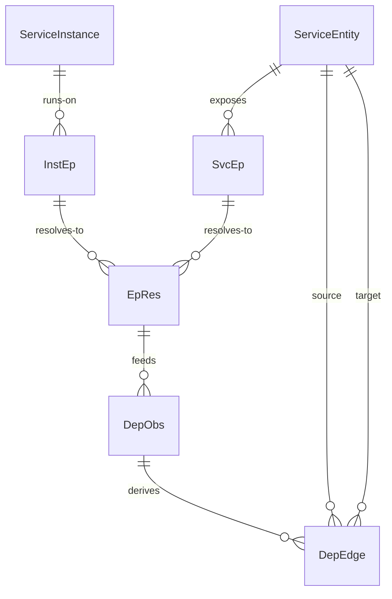

# dayu-topology Endpoint 与 Dependency Observation 子模型设计

## 1. 文档目的

本文档定义 `dayu-topology` 中心侧 `service endpoint`、`instance endpoint` 以及依赖观测对象的子模型。

目标是固定：

- 服务入口地址与实例运行地址如何表达
- 服务依赖如何区分声明关系与观测关系
- 依赖观测证据如何落库
- 这部分如何与已有 `service / instance / runtime binding / network` 模型衔接

相关文档：

- [`glossary.md`](../glossary.md)
- [`business-system-service-topology-model.md`](./business-system-service-topology-model.md)
- [`runtime-binding-model.md`](./runtime-binding-model.md)
- [`host-pod-network-topology-model.md`](./host-pod-network-topology-model.md)
- [`cluster-namespace-workload-topology-model.md`](./cluster-namespace-workload-topology-model.md)

---

## 2. 核心结论

第一版固定以下结论：

- `SvcEp` 与 `InstEp` 必须分开
- `DepEdge` 只是服务依赖图中的一条边，不能承载所有观测证据细节
- 观测依赖应独立建模为 `DepObs`
- 一条依赖可由多条观测证据支撑，不应直接把流量细节塞进依赖主表
- 依赖观测必须保留时间、来源、方向、置信度和证据语义

一句话说：

- `SvcEp` 回答“服务通过什么稳定入口被访问”
- `DepObs` 回答“系统为什么认为两个服务当前存在调用关系”

---

## 3. 为什么必须单独建模

如果直接把依赖写成：

```text
DepEdge {
  source_ip
  target_ip
  port
  protocol
  trace_id
}
```

或者把 endpoint 写成：

```text
ServiceEntity {
  address
}
```

会出现明显问题：

- 一个服务可有多个稳定入口
- 一个实例也可有多个动态地址
- 一条服务依赖可能由很多次观测共同支撑
- 依赖事实和观测证据不是同一层对象
- 观测细节量大、变化快，不适合塞入主关系表

因此应明确：

- endpoint 是可连接地址对象
- dependency 是关系对象
- observation 是证据对象

---

## 4. 模型定位

这不是新的顶层模型，而是服务拓扑中的“连接与依赖证据”子模型。

它主要回答：

- 服务通过哪些地址暴露出来
- 实例当前通过哪些地址运行
- 哪两个服务之间被观测到存在依赖
- 这种依赖是基于什么证据判定的

---

## 5. 对象模型

### 5.0 核心术语中英对照

<!-- GLOSSARY_SYNC:START terms=SvcEp,InstEp,DepEdge,DepObs,DepEv,EpRes -->
| 术语 | 中文名 | English | 中文说明 |
| `SvcEp` | 服务稳定入口 | Service endpoint | 表示服务的稳定访问入口，例如 DNS、VIP、Ingress。 |
| `InstEp` | 实例运行地址 | Instance endpoint | 表示实例当前运行地址，例如 Pod IP:Port 或 Host IP:Port。 |
| `DepEdge` | 服务依赖边 | Dependency edge | 表示服务依赖图中的一条边，不直接承载原始观测明细。 |
| `DepObs` | 依赖观测对象 | Dependency observation object | 表示从运行数据归一出的依赖观测摘要。 |
| `DepEv` | 依赖观测证据 | Dependency evidence | 表示支撑依赖观测结论的具体证据。 |
| `EpRes` | 地址归一结果 | Endpoint resolution object | 表示地址如何解析回服务或实例的桥接对象。 |


<!-- GLOSSARY_SYNC:END -->

### 5.1 `SvcEp`

沿用已有定义，表示服务稳定入口。
字段中英说明以 [`business-system-service-topology-model.md`](./business-system-service-topology-model.md) 中的 `SvcEp` 为准。

典型示例：

- DNS
- ClusterIP
- Service DNS
- LoadBalancer VIP
- Ingress 域名
- External API hostname

### 5.2 `InstEp`

沿用已有定义，表示实例当前地址。

典型示例：

- Pod IP:Port
- Host IP:Port
- Container IP:Port

### 5.3 `DepObs`

表示一次归一后的依赖观测记录。

建议结构：

```text
DepObs {
  observation_id
  up_svc_id?
  up_inst_id?
  down_svc_id?
  down_inst_id?
  observation_type
  trans_proto?
  app_proto?
  endpoint_sig?
  confidence
  source
  first_observed_at
  last_observed_at
  sample_count?
  created_at
  updated_at
}
```

字段中英说明：

| 字段 | 中文说明 | English |
| --- | --- | --- |
| `observation_id` | 依赖观测主键 | Observation ID |
| `up_svc_id` | 上游服务 ID | Upstream service ID |
| `up_inst_id` | 上游实例 ID | Upstream instance ID |
| `down_svc_id` | 下游服务 ID | Downstream service ID |
| `down_inst_id` | 下游实例 ID | Downstream instance ID |
| `observation_type` | 观测类型 | Observation type |
| `trans_proto` | 传输层协议 | Transport protocol |
| `app_proto` | 应用层协议 | Application protocol |
| `endpoint_sig` | 端点签名 | Endpoint signature |
| `confidence` | 置信度 | Confidence |
| `source` | 来源 | Source |
| `first_observed_at` | 首次观测时间 | First observed time |
| `last_observed_at` | 最近观测时间 | Last observed time |
| `sample_count` | 样本数量 | Sample count |
| `created_at` | 创建时间 | Created time |
| `updated_at` | 更新时间 | Updated time |

`observation_type` 示例：

- `network_flow`
- `trace_span`
- `access_log`
- `dns_resolution`
- `config_declared`

`source` 示例：

- `otel_trace`
- `envoy_log`
- `ebpf_flow`
- `nginx_access_log`
- `manual_import`

说明：

- `DepObs` 是观测归一后的摘要对象
- 它不等同原始流量或原始 span

### 5.4 `DepEv`

表示某条观测依赖的具体证据。

建议结构：

```text
DepEv {
  evidence_id
  observation_id
  evidence_type
  evidence_ref?
  source_address?
  source_port?
  target_address?
  target_port?
  protocol?
  score?
  observed_at
  metadata?
  created_at
}
```

字段中英说明：

| 字段 | 中文说明 | English |
| --- | --- | --- |
| `evidence_id` | 证据主键 | Evidence ID |
| `observation_id` | 归属观测 ID | Observation ID |
| `evidence_type` | 证据类型 | Evidence type |
| `evidence_ref` | 原始证据引用 | Evidence reference |
| `source_address` | 源地址 | Source address |
| `source_port` | 源端口 | Source port |
| `target_address` | 目标地址 | Target address |
| `target_port` | 目标端口 | Target port |
| `protocol` | 协议 | Protocol |
| `score` | 证据评分 | Score |
| `observed_at` | 证据观测时间 | Observed time |
| `metadata` | 扩展元数据 | Metadata |
| `created_at` | 创建时间 | Created time |

`evidence_type` 示例：

- `trace_edge`
- `flow_tuple`
- `log_request`
- `dns_answer`
- `route_config`

说明：

- 这层是证据层，不一定要长期保留全部明细
- 第一版可保留摘要证据与原始载荷引用

### 5.5 `EpRes`

表示地址如何解析到服务或实例。

建议结构：

```text
EpRes {
  resolution_id
  endpoint_kind
  address
  port?
  svc_id?
  inst_id?
  scope
  confidence
  source
  valid_from
  valid_to?
  created_at
  updated_at
}
```

字段中英说明：

| 字段 | 中文说明 | English |
| --- | --- | --- |
| `resolution_id` | 归一结果主键 | Resolution ID |
| `endpoint_kind` | 地址类型 | Endpoint kind |
| `address` | 地址值 | Address |
| `port` | 端口 | Port |
| `svc_id` | 解析出的服务 ID | Resolved service ID |
| `inst_id` | 解析出的实例 ID | Resolved instance ID |
| `scope` | 解析范围 | Resolution scope |
| `confidence` | 置信度 | Confidence |
| `source` | 来源 | Source |
| `valid_from` | 生效开始时间 | Valid from |
| `valid_to` | 生效结束时间 | Valid to |
| `created_at` | 创建时间 | Created time |
| `updated_at` | 更新时间 | Updated time |

`endpoint_kind` 示例：

- `dns`
- `ip_port`
- `vip`
- `ingress_host`

`scope` 示例：

- `service`
- `instance`

说明：

- 依赖观测通常先看到地址，再把地址归一到 service / instance
- 这层对象是地址世界和服务世界之间的桥梁

---

**图：端点与依赖观测 ER 关系**



> `SvcEp` 是服务稳定入口地址，`InstEp` 是实例运行时地址。`EpRes` 将观测到的地址解析回服务/实例。多次 `DepObs`（观测证据）聚合后生成 `DepEdge`（稳定依赖边）。

---

## 6. 关系图谱

第一版建议固定以下关系：

```text
ServiceEntity
  -> SvcEp[]
  -> DepEdge[]

ServiceInstance
  -> InstEp[]

EpRes
  -> ServiceEntity / ServiceInstance

DepObs
  -> DepEv[]
  -> EpRes[]
  -> DepEdge?
```

主链路可表达为：

```text
network/log/trace evidence
  -> DepEv
  -> DepObs
  -> EpRes
  -> ServiceEntity / ServiceInstance
  -> DepEdge
```

### 6.1 `DepEv / DepObs / EpRes / DepEdge` 四者关系

这四者不是同一层对象。

分层关系：

| 对象 | 所在层 | 回答的问题 | 是否最终依赖图 |
| --- | --- | --- | --- |
| `DepEv` | 证据层 | 哪条原始事实支持这个判断 | 否 |
| `DepObs` | 观测摘要层 | 系统观测到一次什么依赖现象 | 否 |
| `EpRes` | 地址解析层 | 观测到的地址对应哪个服务或实例 | 否 |
| `DepEdge` | 依赖图层 | 哪个服务依赖哪个服务 | 是 |

生成关系：

```text
DepEv[]          // 多条 trace / log / flow / dns 证据
  -> DepObs      // 聚合成一次依赖观测摘要
  -> EpRes[]     // 把地址解析成 service / instance
  -> DepEdge     // 多个观测聚合后形成服务依赖边
```

更准确地说：

- `DepEv` 是原始证据的摘要或引用，例如一条 trace edge、一条访问日志、一条 flow tuple
- `DepObs` 是从多条证据归一出来的观测结果，例如“过去 5 分钟 A 访问了 10.0.1.8:8080”
- `EpRes` 负责把 `10.0.1.8:8080` 解析成 `InstEp`、`ServiceInstance` 或 `ServiceEntity`
- `DepEdge` 是最终依赖图的一条边，例如 `svc-order -> svc-payment`

数量关系：

- 一个 `DepObs` 可以有多条 `DepEv`
- 一个 `DepObs` 可以关联多个 `EpRes`，例如同时解析源地址和目标地址
- 一个 `DepEdge` 可以由多个 `DepObs` 支撑
- 一个 `DepObs` 不一定能生成 `DepEdge`，例如地址无法解析或证据不足

落库原则：

- `DepEv` 可短期保留或只保留原始引用
- `DepObs` 保留观测摘要，用于 explain 和重新聚合
- `EpRes` 可复用，不只服务依赖会用到地址解析
- `DepEdge` 是最终服务依赖图，不应塞入原始证据明细

---

## 7. 声明依赖与观测依赖

### 7.1 声明依赖

来源包括：

- 架构设计文档
- 平台配置
- service mesh route
- 人工导入

特点：

- 稳定性高
- 变化相对慢
- 可作为期望关系

### 7.2 观测依赖

来源包括：

- trace span
- 流量日志
- eBPF 网络流
- DNS 解析日志
- 网关访问日志

特点：

- 变化快
- 可能有噪声
- 可用于验证声明依赖，或发现隐式依赖

结论：

- `DepEdge` 字段中英说明以 [`business-system-service-topology-model.md`](./business-system-service-topology-model.md) 中的定义为准
- `DepEdge` 建议保留 `scope = declared / observed`
- `DepEdge` 只表达依赖边，不表达调用样本、统计指标或网络路径
- 但具体观测证据应落到 `DepObs`

### 7.3 如何生成 `DepEdge`

`DepEdge` 不应由单条访问日志或单条网络流直接生成。

第一版建议流程：

```text
trace / access log / flow / dns / gateway log
  -> DepEv
  -> DepObs
  -> EpRes
  -> DepEdge
```

也就是说：

- 原始访问流量、日志、trace 先进入证据层
- 证据归一后形成 `DepObs`
- 观测中的地址通过 `EpRes` 解析到 `ServiceEntity` 或 `ServiceInstance`
- 多条观测在时间窗口内聚合后，才生成或刷新 `DepEdge`
- 如果目标是外部 API、SaaS 或合作方服务，也应解析到 `boundary = external / partner / saas` 的 `ServiceEntity`

可以用来推导依赖边的信号：

- trace span 中的 caller / callee
- access log 中的 upstream / downstream 地址
- 网关或 service mesh 的 route / cluster 日志
- eBPF flow 中的五元组
- DNS 解析结果与后续连接行为
- 平台配置中的 route、service binding、DB 连接配置

不能直接作为依赖边的信号：

- 单次端口扫描
- 单条失败连接
- 单个 DNS 查询且没有后续访问
- 只有 IP 连通但无法解析到服务身份
- 健康检查、监控探针、sidecar 控制面流量

生成 `DepEdge` 的最小条件：

- 能解析出 `up_svc_id`
- 能解析出 `down_svc_id`
- 在一个时间窗口内有足够证据支持
- 能标明 `scope`、`source` 和 `valid_from`

准确性建议：

- `declared` 依赖来自配置、人工导入或平台声明，准确性通常更高
- `observed` 依赖来自流量、日志、trace，需要置信度和去噪
- 多来源一致时可以提升依赖边可信度
- 单来源、低频、短时间出现的观测应先停留在 `DepObs`
- 依赖边消失不应立即删除，应通过 `valid_to` 或状态过期表达

### 7.4 大量日志如何计算

大量日志不建议逐条直接写 `DepEv / DepObs / DepEdge`。
第一版建议采用“流式预聚合 + 窗口聚合 + 异步落库”的方式。

推荐处理链路：

```text
raw logs / traces / flows
  -> parse
  -> normalize
  -> filter noise
  -> resolve endpoint with cache
  -> aggregate by window
  -> write DepObs summary
  -> refresh DepEdge
```

#### 7.4.1 单条日志处理

每条日志先只做轻量处理：

- 解析时间、来源、源地址、目标地址、端口、协议、状态码、trace id
- 标准化地址格式，例如 IP、host、port、protocol
- 标记明显噪声，例如 health check、metrics scrape、sidecar 控制面流量
- 生成候选 key，不立即生成 `DepEdge`

候选 key 示例：

```text
tenant_id
source
src_addr
src_port?
dst_addr
dst_port
protocol
time_bucket
```

#### 7.4.2 地址解析

地址解析不应每条日志都查库。

建议：

- 先查本地缓存或流处理状态
- 缓存未命中时再查 `EpRes / SvcEp / InstEp / HostNetAssoc / PodNetAssoc`
- 解析结果带有效期，过期后重新解析
- 无法解析的地址先进入 unresolved bucket，不直接生成 `DepEdge`

解析结果可分为：

- `resolved_service`
- `resolved_instance`
- `unresolved_addr`
- `conflict`

#### 7.4.3 窗口聚合

将日志按时间窗口聚合，而不是逐条落依赖边。

建议窗口：

- 1 分钟：用于近实时发现
- 5 分钟：用于生成较稳定的 `DepObs`
- 1 小时：用于降噪和趋势分析

聚合维度：

```text
tenant_id
up_svc_id?
up_inst_id?
down_svc_id?
down_inst_id?
protocol
source
time_window
```

聚合指标：

- `sample_count`
- `success_count`
- `error_count`
- `first_seen_at`
- `last_seen_at`
- `sources`
- `confidence`

#### 7.4.4 生成 `DepObs`

`DepObs` 是窗口聚合后的观测摘要。

生成条件：

- 样本数量达到阈值
- 能解析出至少下游服务或实例
- 不是明显噪声流量
- 时间窗口内有连续性

第一版可以不保存每条 `DepEv`，只保存：

- 样本引用
- 原始日志批次 ID
- top N 示例
- 统计摘要

#### 7.4.5 刷新 `DepEdge`

`DepEdge` 由多个 `DepObs` 聚合刷新。

建议规则：

- 连续多个窗口出现，才创建新的 observed `DepEdge`
- 已存在的 `DepEdge` 只刷新 `last_seen_at` 或延长有效期
- 长时间未出现，不立即删除，先标记过期或写 `valid_to`
- 声明依赖和观测依赖分开，不要互相覆盖

示例阈值：

```text
create DepEdge if:
  sample_count >= 3
  and confidence >= medium
  and seen_in_windows >= 2

expire DepEdge if:
  no DepObs for 24h
  and scope = observed
```

#### 7.4.6 处理原则

- 热路径只做 parse、normalize、filter、aggregate
- 地址解析要缓存，避免每条日志查库
- 原始日志进入日志系统或对象存储，不进入拓扑主表
- 拓扑库只保留摘要、关系和可解释引用
- 高基数字段如 URL path、trace id 不进入 `DepEdge`
- 所有噪声过滤规则必须可解释，避免误删真实依赖

---

## 8. 与现有模型的衔接

### 8.1 与 `ServiceEntity / ServiceInstance` 模型

- `SvcEp` 继续承载稳定入口
- `InstEp` 继续承载实例地址
- `EpRes` 负责把观测到的地址归一到服务或实例

### 8.2 与 `RuntimeBinding` 模型

- 如果观测先命中进程或 Pod 地址，再经 `RuntimeBinding` 回连到 `ServiceInstance`
- 所以依赖观测与运行绑定应协同使用，而不是互相替代

### 8.3 与 `Host / Pod / Network` 模型

- `PodNetAssoc` 和 `HostNetAssoc` 表达网络接入事实
- `DepObs` 表达“实际发生了依赖/访问”
- 接入网络不等于一定存在依赖调用

---

## 9. 第一版查询视图建议

### 9.1 Endpoint 视图

从 `ServiceEntity` 或 `ServiceInstance` 出发，展示：

- 稳定入口地址
- 当前实例地址
- 地址解析如何回连到 service / instance

说明：

- 稳定入口地址来自 `SvcEp`
- 当前实例地址来自 `InstEp`
- 两者地址值可能相同，但语义、生命周期和来源不同

### 9.2 Dependency 视图

从 `DepEdge` 出发，展示：

- 声明依赖还是观测依赖
- 最近一次观测时间
- 主要证据来源
- 主要命中端点签名

### 9.3 Observation Explain 视图

单独展示：

- 为什么系统判定 A 依赖 B
- 命中了哪些 trace / flow / log 证据
- 地址是如何解析成服务对象的

---

## 10. PostgreSQL 存储建议

第一版建议增加：

- `dep_obs`
- `dep_ev`
- `ep_res`

关键约束建议：

- `ep_res(endpoint_kind, address, port, valid_to)` 建索引
- `dep_obs(up_svc_id, down_svc_id, source, last_observed_at)` 建索引
- `dep_ev(observation_id, observed_at)` 建索引

---

## 11. 第一版最小落地范围

当前建议固定为：

- 先支持 `DepObs`
- 先支持 `DepEv`
- 先支持 `EpRes`
- 继续沿用现有 `SvcEp` / `InstEp`

第一版先不要一开始做得过重：

- 不必先存全量原始 trace / flow 明细
- 不必先做复杂调用图权重算法
- 不必先做毫秒级实时依赖更新

先把：

- 地址如何归一到 service / instance
- 观测依赖如何落摘要
- 依赖证据如何解释

三件事固定住。

---

## 12. 当前建议

当前建议固定为：

- endpoint、dependency、observation 必须三层分开
- 地址归一化是依赖观测可落地的关键桥梁
- 观测依赖不应直接等于原始日志或 trace
- 后续依赖图、风险传播、故障影响分析都应依赖这层模型
