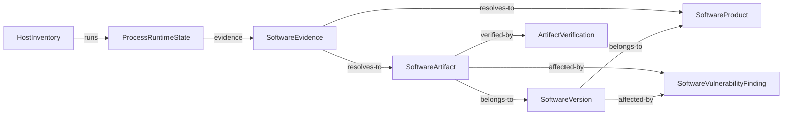

# dayu-topology Host / Process / Software / Vulnerability 关联图谱设计

## 1. 文档目的

本文档定义 `dayu-topology` 中主机、进程、软件和漏洞 finding 之间的中心侧关联图谱。

目标是固定一个清晰的数据关系，避免：

- 把漏洞列表直接塞进 host 对象
- 把 software entity 混成 process runtime state
- 把 process resource 与 software identity 直接等同

相关文档：

- [`glossary.md`](../glossary.md)
- [`host-inventory-and-runtime-state.md`](host-inventory-and-runtime-state.md)
- [`host-pod-network-topology-model.md`](host-pod-network-topology-model.md)
- [`software-normalization-and-vuln-enrichment.md`](software-normalization-and-vuln-enrichment.md)
- [`public-vulnerability-source-ingestion.md`](public-vulnerability-source-ingestion.md)

---

## 2. 核心结论

第一版应固定以下关系：

```text
HostInventory
  -> ProcessRuntimeState[]
  -> SoftwareEvidence[]

SoftwareEvidence
  -> SoftwareArtifact
  -> ArtifactVerification
  -> SoftwareVersion
  -> SoftwareProduct

SoftwareVersion / SoftwareArtifact
  -> SoftwareVulnerabilityFinding[]
  -> SoftwareBugFinding[]
```

一句话说：

- 主机承载运行对象
- 软件按产品、版本、制品分层
- 漏洞和 BUG 通常挂在软件版本上，必要时精确到具体制品

---

## 3. 对象职责

### 3.1 `HostInventory`

回答：

- 这台主机是谁

### 3.2 `ProcessRuntimeState`

回答：

- 这台主机上当前有哪些进程、状态如何

### 3.3 `SoftwareEvidence`

回答：

- 哪些进程/路径/包事实指向某个软件候选

### 3.4 `SoftwareProduct / SoftwareVersion / SoftwareArtifact`

回答：

- 这个软件是什么产品
- 当前命中的是哪个版本
- 对应哪个可执行文件、脚本、包或镜像制品

### 3.5 `SoftwareVulnerabilityFinding`

回答：

- 这个软件当前被哪些公开或 vendor 情报命中

### 3.6 `SoftwareBug / SoftwareBugFinding`

回答：

- 这个软件版本或制品有哪些已知缺陷
- 当前主机、进程或制品是否命中了某个 BUG
- 该 BUG 是否与安全漏洞 finding 有关联

---

## 4. 关系细节

### 4.1 `host -> process`

- 一台主机对应多个进程动态对象

### 4.2 `process -> software evidence`

- 一个进程可以产生一条或多条 software evidence
- 例如：
  - 可执行路径
  - 安装 bundle
  - signer
  - package manager 信息

### 4.3 `software evidence -> software product/version/artifact`

- 多条 evidence 可收敛到同一个 `artifact_id`、`version_id` 或 `product_id`
- 同一软件的多个 helper / renderer 进程可归一到同一个产品，但可能对应不同制品
- 可执行文件和脚本应优先使用 `sha256` 区分具体制品
- 运行程序是否真实可信，应通过 `ArtifactVerification` 判断

### 4.4 `artifact verification`

- 进程名、路径和 PID 不能证明程序真实
- `ArtifactVerification` 比对运行时 `observed_sha256` 与可信 `expected_sha256`
- 签名、包源、镜像来源和远程证明可提升可信度
- 验真失败时，不应高置信归一到对应软件制品

### 4.5 `software version / artifact -> vulnerability findings`

- 一个软件版本可对应多个 finding
- 一个具体 artifact 可用于确认真实文件或脚本是否命中
- 一个 finding 可聚合多个 advisory source

### 4.6 `software version / artifact -> bug findings`

- 一个软件版本可对应多个 BUG
- 一个具体 artifact 可用于确认某个文件、脚本或包是否命中 BUG
- 普通 BUG 不等同漏洞
- 有安全影响的 BUG 可通过 `SoftwareBugVulnLink` 关联到漏洞 finding
- 错误日志、异常栈、crash dump 可作为 BUG evidence，但不能直接等同 `SoftwareBug`

---

## 5. 不应采用的错误关系

以下关系应明确禁止：

- `HostInventory` 直接内嵌完整漏洞列表
- `ProcessRuntimeState` 直接作为软件产品、版本或制品
- `process.executable.name` 直接当最终漏洞查询键
- 只按脚本名或路径判断脚本风险，不计算脚本内容 `sha256`
- 只凭进程名或路径认为运行程序可信
- 把所有 BUG 都当成漏洞
- 用 CVE 编号替代 vendor bug id 或 issue id

---

**图：主机-进程-软件-漏洞链路**



> 从主机出发，经进程 → 软件证据 → 制品/版本/产品，最终关联漏洞。`SoftwareEvidence` 是进程事实到软件身份的桥，`ArtifactVerification` 验证制品可信性。

---

## 6. 查询视图建议

### 6.1 主机视图

从 `HostInventory` 出发，展示：

- 主机基础信息
- 当前进程数量
- 当前软件数量
- 软件漏洞汇总摘要

### 6.2 进程视图

从 `ProcessRuntimeState` 出发，展示：

- 进程身份
- 可执行路径
- 归属软件实体
- 归属软件的漏洞摘要

### 6.3 软件视图

从 `SoftwareProduct / SoftwareVersion / SoftwareArtifact` 出发，展示：

- 归属主机数量
- 归属进程数量
- 外部标识
- 生命周期
- 漏洞 finding
- BUG finding
- 可执行文件或脚本的 `sha256`
- 运行制品验真结果

---

## 7. 当前建议

当前建议固定为：

- 主机、进程、软件、漏洞必须分层建模
- 漏洞通过软件版本或制品关联回主机和进程
- BUG 通过软件版本或制品关联回主机和进程
- BUG 与漏洞可以关联，但不能混为同一个对象
- 运行程序真实性通过 `ArtifactVerification` 表达
- 不直接把漏洞作为 host/process 的原生字段
